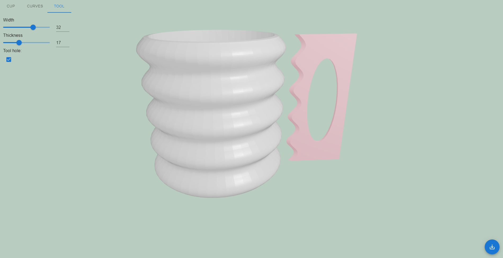
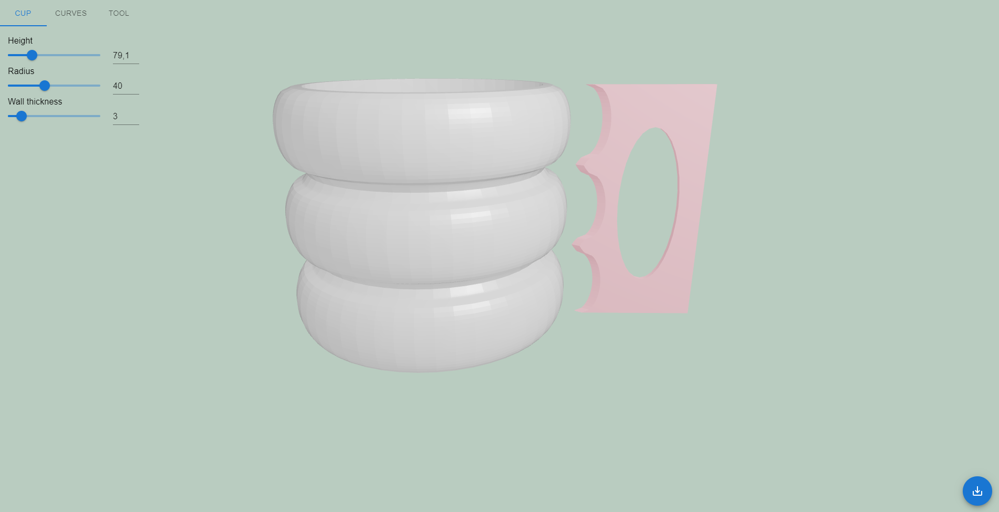
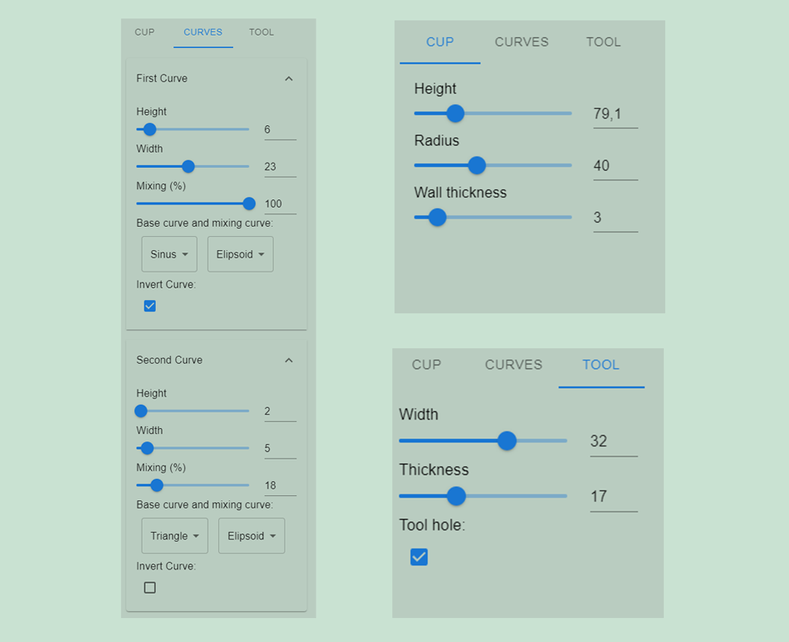

# Info
This vite + react website enables the user to create a custom ceramic rib tool with the additional help of seeing the corresponding cup this tool creates in realtime. 

Below you can see two examples of such cups. 

Here is a collection of all the parameters the user can change.

# How to install
This is not yet deployed anywhere so to use it you have to execute the following steps:

1. download this repository

2. in the console type `npm install` 

3. then run `npm run dev` 

4. open up [localhost](http://localhost:5173/)

5. create your custom ceramic rib tool and download it using the button in the bottom right
